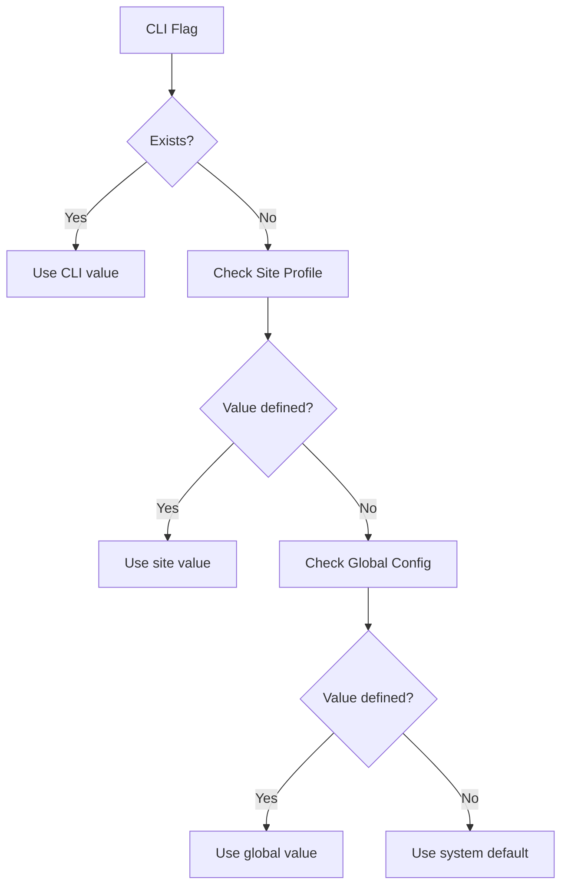

# Site Profile Inheritance Rules

This guide explains how the Hugo Translation System handles configuration inheritance across global defaults, site profiles, and CLI overrides.

## Overview

The Hugo Translation System uses a layered configuration approach with clear priority rules. Configuration values are resolved in this order (highest to lowest priority):

1. **CLI flags** - Runtime overrides from command line
2. **Site profile settings** - Site-specific configuration in `config/site_profiles/*.yaml`
3. **Global configuration** - System-wide defaults in `config/global.yaml`
4. **System defaults** - Built-in fallback values

## Configuration Layers

### 1. Global Defaults (`config/global.yaml`)

The global configuration provides system-wide defaults that apply to all sites unless overridden. Key sections include:

- **Translation Memory (TM) defaults**: Semantic TM settings, thresholds, cache sizes
- **Model defaults**: Fallback models, device settings, batch sizes
- **Hardware configuration**: GPU settings, memory limits
- **Validation defaults**: Global validation modes and decision rules
- **Terminology defaults**: Global terminology preservation rules
- **Performance settings**: Parallel processing, caching

Example global defaults:
```yaml
tm_defaults:
  use_semantic_tm: true
  semantic_threshold: 0.80
  fallback_exact_only: false

validation_defaults:
  mode: "normal"
  decision_rules:
    reject_on_error_count: 3
    max_retry_attempts: 2
```

### 2. Site Profiles (`config/site_profiles/*.yaml`)

Site profiles inherit from global defaults and provide site-specific overrides. Each profile can customize:

- **Content structure**: Content roots, source/target languages
- **Frontmatter rules**: How to handle specific fields (translate/keep/remove)
- **Body processing**: Markdown translation, placeholder preservation
- **Validation settings**: Validation mode, validator enablement
- **Terminology**: Site-specific terms and patterns
- **Output layout**: File organization patterns

Example site profile inheritance:
```yaml
# Inherits global validation_defaults.mode = "normal"
validation:
  enabled: true
  validation_mode: normal  # Overrides global default

# Inherits global tm_defaults but can override
tm_prefs:
  use_semantic_tm: true    # Same as global
  min_similarity_score: 0.8  # Site-specific addition

# Site-specific terminology
terminology:
  enabled: true
  preserve_mode: BOTH      # Inherits from global
  inherit_global: true     # Include global terminology rules
  custom_terms:
    - term: "API"
      category: technical_term
      preserve_mode: both
      severity: error
```

### 3. CLI Overrides

CLI flags provide runtime overrides that take highest priority. Common override categories:

- **Validation control**: `--validation-mode`, `--disable-validation`
- **Terminology control**: `--enable-terminology`, `--terminology-mode`
- **Model control**: `--model`, `--batch-size`
- **Input/Output**: `--input`, `--target-langs`, `--output`
- **Logging**: `--log-level`, `--dry-run`

## Inheritance Examples

### Example 1: Validation Mode Inheritance

**Global default** (`config/global.yaml`):
```yaml
validation_defaults:
  mode: "normal"
```

**Site profile** (`config/site_profiles/docs.aspose.net.yaml`):
```yaml
validation:
  enabled: true
  validation_mode: normal  # Inherits global default
```

**CLI override**:
```bash
translate-hugo --site docs.aspose.net --validation-mode strict
```
**Result**: Uses `strict` mode (CLI override wins)

### Example 2: Terminology Inheritance

**Global terminology** (`config/terminology.yaml`):
```yaml
global:
  exact_matches:
    - term: "Aspose"
      preserve_mode: both
      severity: error
    - term: ".NET"
      preserve_mode: both
      severity: error
```

**Site profile** (`config/site_profiles/docs.aspose.net.yaml`):
```yaml
terminology:
  enabled: true
  preserve_mode: BOTH
  inherit_global: true
  custom_terms:
    - term: "API"
      category: technical_term
      preserve_mode: both
      severity: error
```

**Result**: Site inherits "Aspose" and ".NET" from global, plus adds "API"

### Example 3: TM Preferences Inheritance

**Global defaults** (`config/global.yaml`):
```yaml
tm_defaults:
  use_semantic_tm: true
  semantic_threshold: 0.80
  l1_cache_size: 10000
```

**Site profile** (`config/site_profiles/blog.aspose.net.yaml`):
```yaml
tm_prefs:
  use_semantic_tm: true      # Same as global
  fallback_exact_only: false # Same as global
  min_similarity_score: 0.7  # Site-specific override
```

**Result**: Inherits all global TM settings but uses `min_similarity_score: 0.7` instead of global default

## Complete Inheritance Flow

Here's how a configuration value is resolved:



## Best Practices

### 1. Global Defaults
- Set sensible defaults for all sites
- Use conservative settings (normal validation, standard TM thresholds)
- Enable all validators by default

### 2. Site Profiles
- Only override what needs to be different
- Use `inherit_global: true` for terminology unless site is completely unique
- Document site-specific requirements in profile comments

### 3. CLI Overrides
- Use for one-off changes or testing
- Prefer site profile changes for permanent site-specific settings
- Use `--dry-run` to test configuration changes

## Troubleshooting

### Common Issues

**Issue**: Site profile settings not taking effect
**Check**: Ensure site profile file exists in `config/site_profiles/` with correct naming
**Verify**: Run with `--log-level DEBUG` to see configuration loading

**Issue**: CLI overrides being ignored
**Check**: Confirm flag syntax and values are valid
**Verify**: Some flags may have dependencies (e.g., `--verify` requires validation enabled)

**Issue**: Unexpected inheritance behavior
**Check**: Review configuration priority order
**Verify**: Use `--dry-run` to see final resolved configuration

### Debugging Configuration

Use these commands to inspect configuration resolution:

```bash
# Dry run to see resolved config
translate-hugo --site docs.aspose.net --dry-run --log-level DEBUG

# Check site profile loading
translate-hugo --site docs.aspose.net --log-level INFO | grep -i "profile\|config"
```

## Related Documentation

- [Configuration Reference](../reference/config.md) - Complete configuration schema
- [CLI Reference](../reference/cli.md) - All command-line options
- [Validation Guide](validation-guide.md) - Validation configuration details
- [Terminology Pattern Syntax](../reference/terminology-pattern-syntax.md) - Regex patterns for terminology protection
